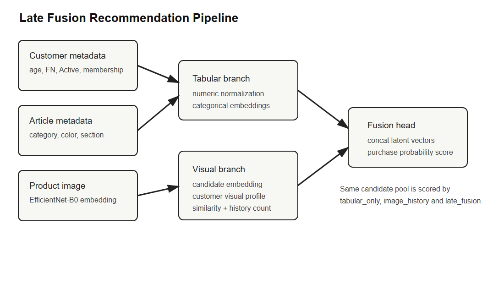
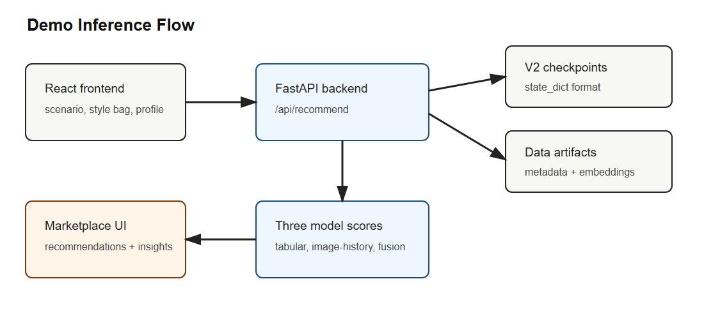
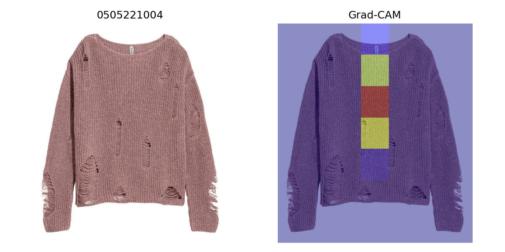

# Perseptron: H&M Veri Seti Üzerinde Multimodal Moda Öneri Sistemi

**Yusuf Duman**  
Bilgisayar Mühendisliği Final Projesi  
Teslim sürümü: 2026-06-02

## Abstract

Bu çalışma, H&M Personalized Fashion Recommendations veri seti üzerinde moda ürünleri için multimodal bir öneri sistemi geliştirmeyi amaçlar. Moda e-ticaretinde satın alma davranışı yalnızca ürün kategorisi, müşteri yaşı veya geçmiş alışveriş sıklığı gibi tabular alanlarla açıklanamaz; ürünün görsel görünümü, renk/siluet yapısı ve müşterinin geçmişte tercih ettiği görsel stil de karar sürecine katkı verir. Bu nedenle çalışmanın temel hipotezi, ürün görsellerinden çıkarılan temsil vektörlerinin müşteri ve ürün metaverisiyle birlikte kullanıldığında yalnızca tabular veya yalnızca görsel modellere göre daha iyi satın alma skoru ve daha iyi öneri sıralaması üreteceğidir. Hipotezi test etmek için üç ana classification modeli karşılaştırılmıştır: müşteri ve ürün metaverisini kullanan `tabular_only`, ürün fotoğrafını doğrudan kullanan EfficientNet-B0 tabanlı `image_only_effnet_cnn`, ve tabular özelliklerle müşteri görsel geçmişini birleştiren `late_fusion`. Ranking ve demo tarafında ise `tabular_only`, müşterinin geçmiş görsellerinden stil profili çıkaran `image_history`, ve ana multimodal model olan `late_fusion` kullanılmıştır. Final Kaggle full-run sonuçlarında `late_fusion`, final AUC 0.8063 ve best AUC 0.8121 ile ana classification karşılaştırmasında en yüksek sonucu vermiştir; ranking tarafında da MAP@12 0.001262 ile ana modeller arasında lider olmuştur. Sonuçlar, görsel bilginin tek başına tabular baseline’ı geçmediğini, fakat tabular bağlamla birleştirildiğinde ölçülebilir katkı sağladığını göstermektedir. Ek olarak SHAP feature summary, Grad-CAM örnekleri ve çalışan FastAPI/React demo uygulaması ile model sonuçları açıklanabilir ve sunulabilir hale getirilmiştir.

## 1. Introduction

Moda öneri sistemleri, klasik ürün öneri problemlerine göre daha fazla modaliteye ihtiyaç duyar. Bir elektronik ürün veya kitap önerisinde kullanıcı geçmişi ve ürün kategorisi çoğu zaman güçlü bir başlangıç noktası sağlayabilir; moda ürünlerinde ise ürünün görsel algısı satın alma kararının merkezindedir. Aynı kategoriye ait iki siyah üst giyim ürünü, kesim, kumaş, siluet ve fotoğraftaki görünüm açısından tamamen farklı müşteri gruplarına hitap edebilir. Bu nedenle bir moda öneri sisteminin yalnızca geçmiş işlem verisini veya yalnızca ürün metadata alanlarını kullanması, müşterinin stil tercihlerini eksik temsil edebilir.

Bu proje H&M Personalized Fashion Recommendations veri setini kullanarak bu problemi incelemektedir. Veri seti müşteri bilgileri, ürün metaverisi, işlem geçmişi ve ürün görsellerini aynı problem altında sunduğu için multimodal öneri sistemlerini değerlendirmek için uygun bir test alanı sağlar. Yarışmanın orijinal görevi, her müşteri için gelecek kısa dönemde satın alınabilecek 12 ürünü sıralamaktır ve değerlendirme metriği MAP@12’dir. Bu görev, yalnızca “satın alır mı?” sorusunu değil, aynı zamanda doğru ürünleri üst sıralara taşıma problemini de içerir. Bu nedenle proje iki ayrı değerlendirme hattı kurmuştur: müşteri-ürün çiftleri için binary classification hattı ve müşteri bazında top-k ranking hattı.

Çalışmanın araştırma sorusu şu şekilde özetlenebilir: Ürün görsellerinden çıkarılan temsiller, müşteri ve ürün metaverisiyle birleştirildiğinde H&M moda öneri probleminde anlamlı performans artışı sağlar mı? Bu soruya cevap vermek için yalnızca tabular özellikleri kullanan bir baseline, yalnızca ürün görselini kullanan bir CNN baseline ve iki modaliteyi birleştiren bir late fusion modeli geliştirilmiştir. Ayrıca öneri demosunda kullanılmak üzere müşterinin geçmiş satın aldığı ürünlerden görsel stil profili çıkaran `image_history` modeli de kurulmuştur. Burada önemli bir ayrım vardır: `image_only_effnet_cnn` görsel baseline ve Grad-CAM kaynağıdır; `image_history` ise kişiselleştirilmiş ranking/demo için kullanılan görsel geçmiş baseline’ıdır.

Projenin katkısı üç noktada toplanır. İlk olarak, H&M veri setinde tabular, image-only ve multimodal late fusion modelleri aynı final validation çerçevesinde karşılaştırılmıştır. İkinci olarak, classification metrikleri ile recommendation ranking metrikleri ayrı tutulmuş; AUC-ROC sonucunun tek başına top-k öneri kalitesini garanti etmediği açıkça gösterilmiştir. Üçüncü olarak, final model çıktıları yalnızca dosya düzeyinde bırakılmamış; FastAPI backend ve React frontend üzerinden çalışan bir demo akışına dönüştürülmüştür. Bu demo, kullanıcı geçmişini seçmeyi, üç modelin önerilerini karşılaştırmayı, ortak/unique önerileri görmeyi ve açıklama etiketleriyle model davranışını yorumlamayı sağlar.

Başlangıç proposal’ında full 5-fold customer-level cross-validation, kapsamlı SHAP analizi ve CNN tabanlı görsel model hedeflenmişti. Final uygulamada Kaggle runtime, GPU kotası ve teslim süresi nedeniyle bazı hedefler sadeleştirilmiştir. Bu sadeleştirme, projenin hipotezini terk etmek anlamına gelmez; aksine aynı split ve aynı pipeline üzerinde çalışan, yeniden üretilebilir ve sunulabilir bir final sistem üretmek için yapılmış metodolojik bir adaptasyondur. Raporun geri kalanında bu kararlar açıkça belirtilmiş, model ayrımları netleştirilmiş ve eski deney metrikleri yerine final V2 Kaggle sonuçları kullanılmıştır.

Bu çalışmanın kapsamı özellikle “araştırma prototipi” olarak düşünülmelidir. Amaç, H&M yarışmasında en yüksek leaderboard skoruna ulaşmak değildir; bunun için çok aşamalı aday üretimi, büyük ölçekli learning-to-rank, ensembling ve haftalarca süren feature engineering gerekir. Bu projede ise daha dar ama akademik olarak daha okunabilir bir soru seçilmiştir: aynı veri ve aynı validation düzeninde görsel sinyal tabular sinyale gerçekten katkı veriyor mu? Bu nedenle sistem tasarımı olabildiğince izlenebilir tutulmuş, her modelin rolü ayrı tanımlanmış ve sonuç yorumları yalnızca finalde gözlenen metriklere dayandırılmıştır.

## 2. Related Work

Öneri sistemleri literatürünün temelinde kullanıcı-ürün etkileşimlerinden gizli tercih yapılarını öğrenen collaborative filtering ve matrix factorization yöntemleri bulunur. Koren, Bell ve Volinsky’nin matrix factorization çalışması, kullanıcı ve ürünleri latent faktör uzaylarında temsil ederek büyük ölçekli öneri problemlerinde güçlü sonuçlar alınabileceğini göstermiştir [1]. Daha sonra He ve arkadaşları, Neural Collaborative Filtering yaklaşımıyla kullanıcı-ürün etkileşimini sabit iç çarpım yerine öğrenilebilir sinir ağı fonksiyonlarıyla modellemiş ve derin öğrenmenin recommendation alanındaki kullanımını genişletmiştir [2]. Bu iki çizgi, davranış verisinin öneri sistemleri için güçlü olduğunu gösterir; ancak moda gibi görsel alanlarda yalnızca etkileşim matrisi çoğu zaman ürünün estetik özelliklerini açıklamakta yetersiz kalır.

Görsel özelliklerin öneri sistemlerine eklenmesi bu eksikliğe cevap verir. He ve McAuley’nin VBPR çalışması, implicit feedback kullanan kişiselleştirilmiş ranking modeline ürün görsel özelliklerini dahil ederek, ürün görünümünün recommendation sinyali olarak kullanılabileceğini göstermiştir [3]. Bu fikir moda alanı için özellikle önemlidir; çünkü kıyafetlerde renk, desen, kesim ve stil çoğu zaman ürünün metinsel veya kategorik açıklamasından daha zengin bilgi taşır. Bu projede de benzer şekilde ürün görselleri doğrudan recommendation skoruna dahil edilmiş, ancak görsel özellikler end-to-end büyük bir CNN içinde değil, EfficientNet-B0 tabanlı embeddingler ve müşteri görsel geçmiş profili üzerinden kullanılmıştır.

Multimodal recommender sistemleri son yıllarda metin, görüntü, ses, bilgi grafı ve davranış verilerini birlikte kullanmaya yönelmiştir. Liu ve arkadaşlarının multimodal recommender sistemleri üzerine survey çalışması, farklı modalitelerin recommendation sistemlerinde item representation, user preference modeling ve cold-start azaltma gibi amaçlarla kullanılabildiğini göstermektedir [4]. Bu literatürde erken fusion, late fusion, attention tabanlı fusion ve transformer tabanlı yaklaşımlar gibi farklı yöntemler bulunur. Bu proje, teslim koşulları ve hesaplama bütçesi nedeniyle daha kontrollü bir late fusion yaklaşımını tercih etmiştir. Late fusion, tabular ve görsel dalları ayrı temsil edip son aşamada birleştirdiği için hem uygulanabilir hem de model katkılarını açıklamak açısından daha savunulabilir bir çözümdür.

Görsel temsil çıkarımı için kullanılan EfficientNet, Tan ve Le tarafından önerilen compound scaling fikrine dayanır [5]. EfficientNet ailesi, model derinliği, genişliği ve giriş çözünürlüğünü dengeli biçimde ölçekleyerek güçlü görsel temsil kapasitesi sunar. Bu projede EfficientNet-B0 iki rolde kullanılmıştır: birincisi image-only CNN baseline olarak ürün görsellerinden satın alma olasılığı tahmini yapmak, ikincisi ise ürün görsellerini 1280 boyutlu embedding vektörlerine dönüştürerek image-history ve late-fusion modellerine görsel sinyal sağlamaktır. Bu ayrım, CNN’in final demo öneri modeli olmadığı, fakat görsel modalitenin ölçülmesi ve Grad-CAM açıklamaları için kullanıldığı anlamına gelir.

Model açıklanabilirliği tarafında SHAP ve Grad-CAM bu projenin iki ayrı modalitesine karşılık gelir. Lundberg ve Lee’nin SHAP çalışması, model tahminlerinde özellik katkılarını Shapley değerleri çerçevesinde yorumlamayı amaçlar [6]. Bu proje SHAP summary çıktısını tabular/metadata tarafındaki etkili özellikleri yorumlamak için kullanmıştır. Görsel tarafta ise Selvaraju ve arkadaşlarının Grad-CAM yöntemi, CNN’in karar verirken görüntüde hangi bölgelere odaklandığını görselleştirmek için uygundur [7]. Grad-CAM bu projede image-only EfficientNet CNN için üretilmiştir; late fusion modelinin tüm kararını doğrudan açıklamaz. Demo tarafındaki açıklama etiketleri ise görsel benzerlik, renk/kategori uyumu ve en yakın geçmiş ürün gibi kullanıcıya dönük, hafif açıklama sinyalleridir.

H&M Personalized Fashion Recommendations yarışması, bu literatürü gerçekçi ve büyük ölçekli bir perakende problemi üzerinde test etmeye olanak verir. Yarışmanın temel görevi, her müşteri için gelecek dönemde satın alınabilecek ürünleri top-12 liste halinde tahmin etmektir [8]. Bu problemde güçlü sonuçlar genellikle candidate generation, feature engineering ve learning-to-rank aşamalarının birlikte tasarlanmasını gerektirir. Bu proje leaderboard optimizasyonunu hedeflememiştir; bunun yerine aynı aday havuzu üzerinde tabular, görsel geçmiş ve multimodal late fusion skorlayıcılarını karşılaştırarak proposal’daki multimodal hipotezi deneysel olarak test etmiştir.

Bu literatürün ortak dersi, recommendation problemlerinde tek bir model türünün çoğu zaman yeterli olmadığıdır. Collaborative filtering kullanıcı davranışını iyi yakalar fakat ürün içeriğini sınırlı kullanır. Görsel modeller ürünün görünümünü iyi temsil eder fakat müşteri bağlamı olmadan kişiselleştirme yapmakta zorlanır. Tabular modeller ürün ve müşteri metaverisini anlaşılır biçimde işler fakat fotoğraftaki stil ve siluet sinyalini kaçırabilir. Bu proje, bu üç zayıflığı küçük ölçekte birleştiren bir geç-fusion yaklaşımı kurar: tabular branch müşteri/ürün bağlamını, visual branch ise ürün görünümü ile müşteri görsel geçmişini temsil eder. Böylece çalışma literatürdeki büyük multimodal sistemlerin daha sade, ders projesi ölçeğinde uygulanabilir bir versiyonu olarak konumlanır.

## 3. Methods

Çalışmada kullanılan temel veri kaynakları H&M veri setindeki `customers.csv`, `articles.csv`, `transactions_train.csv` ve ürün görselleridir. `customers.csv` içinden `FN`, `Active`, `age`, `club_member_status` ve `fashion_news_frequency` alanları müşteri metaverisi olarak alınmıştır. `articles.csv` içinden ürün tipi, ürün grubu, grafik görünüm, renk grubu, perceived colour alanları, departman, index, section ve garment group gibi alanlar ürün metaverisi olarak kullanılmıştır. `transactions_train.csv`, müşteri-ürün satın alma ilişkilerini ve zaman bilgisini sağladığı için hem pozitif örnek üretiminde hem müşteri geçmişi oluşturulmasında temel kaynak olmuştur.

Tabular özellikler sayısal ve kategorik olarak iki gruba ayrılmıştır. Sayısal alanlar training splitinden hesaplanan ortalama ve standart sapma değerleriyle normalize edilmiştir. Kategorik alanlar training verisinde öğrenilen kategori haritalarıyla integer id’ye çevrilmiş ve model içinde embedding katmanlarına verilmiştir. Bilinmeyen kategoriler `__UNK__` id’sine düşürülerek inference sırasında validation veya demo verisinde görülebilecek yeni kategori değerleri için güvenli bir yol oluşturulmuştur. Demo backend de aynı metadata ve encoding bilgilerini kullandığı için eğitim ve inference hattı tutarlı kalmıştır.

Görsel özellikler iki şekilde kullanılmıştır. `image_only_effnet_cnn` modelinde EfficientNet-B0 doğrudan ürün fotoğrafı üzerinde binary classification yapmak üzere kullanılmıştır. Bu model, görsel bilginin müşteri ve ürün metaverisi olmadan ne kadar açıklayıcı olduğunu ölçen image-only baseline’dır. Diğer tarafta, `image_history` ve `late_fusion` modelleri için ürün görsellerinden 1280 boyutlu EfficientNet embeddingleri çıkarılmıştır. Her müşteri için cutoff öncesinde satın aldığı ürünlerin embedding ortalaması alınarak görsel stil profili oluşturulmuştur. Aday ürün embeddingi ile müşteri profil embeddingi arasındaki cosine similarity `visual_similarity`, profilin kaç üründen oluştuğu ise `visual_history_count` özelliği olarak kullanılmıştır.

`tabular_only` modeli müşteri ve ürün metaverisini kullanan MLP baseline’dır. Model, normalize edilmiş sayısal özellikleri ve kategorik embeddingleri birleştirerek müşteri-ürün çiftinin satın alma olasılığını tahmin eder. Bu model görsel bilgi içermez; bu nedenle multimodal katkıyı ölçmek için ana referans noktasıdır. `image_only_effnet_cnn` modeli yalnızca ürün görselini kullanır ve EfficientNet-B0 backbone üzerine binary classification head ekler. Bu modelin amacı kişiselleştirilmiş demo önerisi üretmek değil, proposal’daki görsel baseline hedefini karşılamak ve Grad-CAM çıktısı üretmektir.

`image_history` modeli, aday ürün embeddingi, müşteri görsel profil embeddingi, `visual_similarity` ve `visual_history_count` değerlerini kullanır. Bu model CNN değildir; müşterinin geçmiş satın aldığı ürünlerin görsel karakterinden kişiselleştirilmiş bir stil profili çıkaran visual-history baseline’dır. Demo ve ranking hattında görsel geçmiş sinyalinin tek başına ne yaptığını göstermek için kullanılmıştır. `late_fusion` ise projenin ana multimodal modelidir. Bu modelde tabular branch müşteri ve ürün metaverisini işler, visual branch aday ürün embeddingi ve müşteri görsel profilini işler, ardından iki dalın latent temsilleri fusion head içinde birleştirilerek satın alma skoru üretilir.

Recommendation demo için model skorlamasının öncesinde aday havuzu oluşturulmuştur. Aday havuzu popüler ürünler, müşterinin geçmiş ürünlerine metadata açısından benzeyen ürünler ve görsel embedding uzayında yakın komşular ile desteklenmiştir. Ranking deneylerinde ayrıca co-purchase ve heuristic sinyallerle `late_fusion_hybrid_*` varyantları denenmiştir. Ancak bu hybrid varyantlar ana model değildir; final raporda yalnızca post-ranking/reranking deneyi olarak ele alınır. Ana model karşılaştırması classification tarafında `tabular_only`, `image_only_effnet_cnn`, `late_fusion`; ranking/demo tarafında ise `tabular_only`, `image_history`, `late_fusion` olarak tutulmuştur.

**Şekil 1.** Late fusion pipeline: tabular metadata ve görsel geçmiş sinyalleri ayrı dallarda işlenip final satın alma skoru için birleştirilir.

Model girdilerinin bu şekilde ayrılması, deney sonuçlarının yorumlanmasını kolaylaştırır. `tabular_only` modeli iyi sonuç verdiğinde müşteri/ürün metadata’sının güçlü olduğunu, `image_history` veya CNN sonuçları iyi olduğunda görsel sinyalin tek başına bilgi taşıdığını, `late_fusion` öne geçtiğinde ise iki modalitenin tamamlayıcı olduğunu söylemek mümkün hale gelir. Bu ayrım olmasaydı, örneğin tüm numeric, categorical ve görsel alanlar tek bir büyük özellik vektörüne koyulsaydı, hangi modalitenin nerede katkı verdiği daha belirsiz kalacaktı.

Final demo uygulaması FastAPI backend ve React frontend olarak tasarlanmıştır. Backend `/api/health`, `/api/catalog`, `/api/demo-scenarios`, `/api/recommend`, `/api/metrics` ve `/api/explainability` endpointlerini sağlar. `/api/recommend`, seçilen geçmiş ürünler ve müşteri profili için üç demo modelinin önerilerini, model overlap bilgisini, unique önerileri, request context’i ve öneri bazında açıklama metadata’sını döndürür. Frontend ise aydınlık bir fashion marketplace arayüzü sunar; kullanıcı hazır senaryo seçebilir, katalogdan geçmiş ürün ekleyebilir, önerileri üretebilir ve üç modelin sonuçlarını tab’ler üzerinden karşılaştırabilir.

**Şekil 2.** Demo inference akışı: frontend seçili geçmiş ürünleri backend’e gönderir, backend V2 checkpointleri ve artifactleri kullanarak üç modelin önerilerini döndürür.

Demo tasarımında model eğitimi ile model sunumu ayrılmıştır. Eğitim notebookları Kaggle üzerinde çalışır; demo ise yalnızca final checkpointleri, ürün metadata’sını, embedding dosyalarını ve explainability artifactlerini okur. Bu ayrım sunum sırasında sistemi daha güvenli hale getirir. Ayrıca `/api/health` endpointi checkpoint dosyalarının, embeddinglerin, image directory’nin ve final metric dosyalarının erişilebilir olup olmadığını kontrol eder. Böylece demo başlamadan önce eksik artifact veya yanlış path problemi görülebilir.

## 4. Experimental Design

Deneyler Kaggle üzerinde ayrı notebook aşamaları halinde yürütülmüştür. Notebookların bağımsız olması özellikle teslim ve kontrol açısından tercih edilmiştir; her notebook kendi kodunu, markdown açıklamasını ve çıktı dosyalarını içerir. Akış sırasıyla fold/split hazırlığı, tabular model eğitimi, image-history modeli, late fusion modeli, EfficientNet CNN baseline, ranking değerlendirmesi ve explainability üretimi olarak düzenlenmiştir. Böylece herhangi bir aşamada hata oluştuğunda tüm pipeline’ı yeniden çalıştırmak yerine ilgili aşama tekrar edilebilir hale gelmiştir.

Bu akışın önemli bir tasarım kararı, notebookların repository içindeki Python modüllerine bağımlı olmadan çalışacak şekilde hazırlanmasıdır. Kaggle ortamında her notebook kendi veri okuma, preprocessing, model tanımı, eğitim ve çıktı yazma kodunu içerir. Bu tercih kod tekrarını artırır; ancak final teslim açısından notebookların bağımsız incelenebilmesini sağlar. Ayrıca her aşamanın çıktısı bir sonraki aşamaya açık dosya isimleriyle aktarılır. Örneğin fold/split hazırlığı training ve validation kimliklerini üretir; training notebookları checkpoint ve metrics dosyalarını yazar; ranking notebooku bu checkpointleri okuyarak MAP@12 tablosunu üretir; explainability notebooku ise final model artifactlerinden SHAP ve Grad-CAM çıktıları çıkarır.

| Aşama | Amaç | Ana çıktı |
|---|---|---|
| Fold/split hazırlığı | Time-based validation protokolünü kurmak | Fold summary ve split dosyaları |
| Tabular training | Metadata baseline eğitmek | `tabular_only` checkpoint ve AUC |
| Image-history training | Görsel geçmiş baseline eğitmek | `image_history` checkpoint ve AUC |
| Late-fusion training | Ana multimodal modeli eğitmek | `late_fusion` checkpoint ve AUC |
| EfficientNet CNN training | Image-only baseline ve Grad-CAM kaynağı üretmek | `image_only_effnet_cnn` checkpoint |
| Ranking evaluation | MAP@12 ve top-k metrikleri ölçmek | Ranking metrics CSV |
| Explainability | SHAP ve Grad-CAM çıktıları üretmek | SHAP summary ve Grad-CAM PNG |

**Tablo 1.** Final Kaggle V2 notebook akışı ve artifact çıktıları.

Validation protokolü zaman temelli kurulmuştur. Recommendation probleminde gelecek alışverişi tahmin etmek hedeflendiği için validation penceresindeki işlemlerin training geçmişine sızmaması önemlidir. Bu nedenle müşteri geçmişleri, görsel profiller ve yardımcı aday üretim sinyalleri cutoff öncesi işlemlerden oluşturulmuştur. Classification hattında müşteri-ürün çiftleri pozitif ve negatif örneklerle eğitilmiş, ranking hattında ise müşteri başına aday ürünler üretilerek top-k sıralama değerlendirilmiştir.

Classification ve ranking ayrımı deney tasarımının merkezindedir. Classification hattı modelin müşteri-ürün çiftleri arasında pozitif satın alma örneklerini negatiflerden ayırıp ayıramadığını ölçer. Bu aşamada AUC-ROC yüksekse modelin skor fonksiyonu genel olarak ayırt edici demektir. Ranking hattı ise aynı skoru müşteri bazında ürün listesi üretmek için kullanır ve doğru ürünlerin listenin ilk 12 pozisyonuna girip girmediğini ölçer. Bu nedenle ranking başarısı yalnızca skorlayıcı modele değil, aday havuzunun doğru ürünleri içerip içermemesine de bağlıdır. Final raporda bu iki hattın ayrı tutulması, AUC yüksekken MAP@12 düşük kalmasının teknik olarak çelişki olmadığını göstermek için gereklidir.

Başlangıç proposal’ında full 5-fold customer-level cross-validation hedeflenmişti. Final teslimde bu hedef GPU kotası, Kaggle runtime sınırları ve çoklu model eğitiminin süresi nedeniyle sadeleştirilmiştir. Full 5-fold CV; tabular, image-history, late fusion ve CNN eğitimlerinin her fold için tekrarlanması anlamına geldiğinden teslim süresi içinde yüksek risk taşımıştır. Bunun yerine final full-run validation protokolü üzerinde aynı split ve aynı pipeline kullanılarak modeller karşılaştırılmıştır. Bu karar, sonuçların istatistiksel güvenini full CV kadar artırmasa da, model karşılaştırmasının adil ve yeniden üretilebilir kalmasını sağlar.

Classification deneylerinde temel metrikler AUC-ROC ve accuracy’dir. AUC-ROC, pozitif ve negatif müşteri-ürün çiftlerini ayırt etme kalitesini ölçer; accuracy ise belirli threshold altında sınıflandırma doğruluğu verir. Ranking deneylerinde MAP@12, Precision@10, Recall@10, HitRate@12 ve candidate recall hesaplanmıştır. MAP@12, H&M yarışmasının resmi metriği olduğu için final ranking yorumu bu metrik üzerinden yapılmıştır. Candidate recall ayrıca önemlidir; çünkü doğru ürün aday havuzuna girmediyse skorlayıcı modelin onu üst sıraya taşıma şansı yoktur.

Explainability deneyleri iki parçaya ayrılmıştır. Tabular tarafta SHAP summary üretilmiş ve müşteri/ürün metaverisi içinde hangi alanların model kararına daha fazla katkı verdiği incelenmiştir. Görsel tarafta image-only EfficientNet CNN üzerinde Grad-CAM örnekleri çıkarılmıştır. Bu iki açıklama kaynağı farklı modelleri yorumladığı için raporda ayrı tutulmuştur: SHAP metadata etkisini, Grad-CAM ise CNN’in görsel odak bölgelerini yorumlar. Demo arayüzündeki açıklama chip’leri ise kullanıcıya dönük hafif açıklamalardır ve akademik SHAP/Grad-CAM çıktılarının yerine geçmez.

Reproducibility için final çıktılar rapor klasörüne seçilerek kopyalanmıştır. Classification metrics, CNN metrics, ranking metrics, SHAP summary ve Grad-CAM görselleri `reports/proposal_v2/` altında tutulur. Büyük model checkpointleri ve ham veri dosyaları Git’e normal dosya olarak eklenmemiştir; bunlar local artifact olarak korunur. Bu tercih, repository boyutunu kontrol altında tutarken final rapor ve sunumda kullanılan sayısal sonuçların izlenebilir kalmasını sağlar. Ayrıca notebookların ayrı olması, herhangi bir Kaggle aşamasının tekrar çalıştırılması gerektiğinde hangi çıktının bir sonraki adıma aktarılacağını açık hale getirir.

Deneylerin sınırlılıkları baştan kabul edilmiştir. Negatif örnekleme stratejisi gerçek hayattaki bütün gösterim/veri yokluğu problemini tam temsil etmez; H&M veri setinde müşterinin görmediği bir ürünü “negatif” saymak kaçınılmaz bir yaklaşık modellemedir. Ürün görselleri de farklı fotoğraf kalitesi, poz, arka plan ve ürün görünürlüğü seviyelerine sahiptir. Bu nedenle image-only CNN sonucunun düşük kalması yalnızca görsel modalitenin değersiz olduğunu değil, görsel sinyalin müşteri bağlamı ve iyi aday üretimi olmadan sınırlı kaldığını gösterir. Aynı şekilde ranking sonuçlarının mutlak olarak düşük olması, ana hipotezin yanlışlığından çok candidate generation aşamasının zorluğuna işaret eder.

## 5. Experimental Results

Final full-run classification sonuçları Tablo 2’de verilmiştir. `tabular_only` modeli final AUC 0.7841 ve best AUC 0.7985 elde etmiştir. Bu sonuç, müşteri ve ürün metaverisinin tek başına güçlü bir baseline olduğunu gösterir. `image_only_effnet_cnn` modeli final AUC 0.7513 ve best AUC 0.7602 elde etmiştir. Görsel bilgi tek başına anlamlı bir sinyal taşımakla birlikte tabular baseline’ın altında kalmıştır. `late_fusion` modeli final AUC 0.8063 ve best AUC 0.8121 ile en iyi classification sonucunu vermiştir. Bu durum, projenin ana hipotezini destekler: görsel sinyal en güçlü etkisini tabular bağlamla birlikte kullanıldığında göstermektedir.

| Model | Rol | Train rows | Validation rows | Final AUC | Best AUC | Accuracy |
|---|---:|---:|---:|---:|---:|---:|
| `tabular_only` | Metadata baseline | 400,000 | 85,381 | 0.7841 | 0.7985 | 0.7150 |
| `image_only_effnet_cnn` | Image-only baseline | 39,843 | 9,965 | 0.7513 | 0.7602 | 0.6864 |
| `image_history` | Visual-history baseline | 399,191 | 79,501 | 0.7480 | 0.7480 | 0.6593 |
| `late_fusion` | Multimodal main model | 399,191 | 79,501 | 0.8063 | 0.8121 | 0.7207 |

**Tablo 2.** Final V2 classification sonuçları.

Bu tabloda dikkat çeken ilk eğilim, görsel modellerin tek başına tabular metadata’dan daha düşük kalmasıdır. Bunun olası nedeni, ürün fotoğrafının müşteri bağlamı olmadan satın alma davranışını tam açıklayamamasıdır. Bir ürün görsel olarak çekici olabilir; ancak müşterinin yaşı, geçmiş aktivitesi, ürün kategorisiyle ilişkisi ve metaveri bağlamı olmadan kişiselleştirilmiş satın alma tahmini eksik kalır. Buna karşılık late fusion, tabular branch ile visual branch’i birlikte kullandığı için hem ürün/müşteri metadata’sını hem de görsel stil uyumunu aynı skorda birleştirebilmiştir.

Ranking sonuçları Tablo 3’te gösterilmiştir. Ana ranking karşılaştırması `tabular_only`, `image_history` ve `late_fusion` modelleri üzerindedir. Hybrid varyantlar tabloda raporlanmış olsa da ana model iddiasının parçası değildir. `late_fusion`, MAP@12 0.001262 ile ana modeller arasında liderdir. `tabular_only` MAP@12 0.000713, `image_history` ise MAP@12 0.000653 elde etmiştir. Ranking metriklerinin mutlak değerleri düşüktür; bu durum H&M veri setindeki çok geniş ürün kataloğu, kısa validation penceresi, seyrek müşteri davranışı ve candidate recall sınırından kaynaklanır.

| Model | MAP@12 | Precision@10 | Recall@10 | HitRate@12 | Candidate Recall |
|---|---:|---:|---:|---:|---:|
| `late_fusion` | 0.001262 | 0.000889 | 0.003256 | 0.009906 | 0.241120 |
| `late_fusion_hybrid_w025` | 0.000961 | 0.000796 | 0.002871 | 0.009516 | 0.241120 |
| `late_fusion_hybrid_w045` | 0.000910 | 0.000733 | 0.002825 | 0.008424 | 0.241120 |
| `late_fusion_hybrid_w065` | 0.000714 | 0.000741 | 0.002418 | 0.008190 | 0.241120 |
| `tabular_only` | 0.000713 | 0.000858 | 0.002702 | 0.008658 | 0.241120 |
| `image_history` | 0.000653 | 0.000764 | 0.002404 | 0.008892 | 0.241120 |

**Tablo 3.** Final V2 ranking sonuçları.

Ranking sonuçlarının en önemli yorumu, candidate recall tüm modeller için aynı olduğu halde late fusion skorlayıcısının daha iyi sıralama üretmesidir. Bu, performans farkının aday havuzundan değil, skorlamadan kaynaklandığını gösterir. Hybrid reranking varyantlarının ana late fusion modelini geçememesi de ayrıca anlamlıdır. Co-purchase ve heuristic sinyaller sezgisel olarak faydalı görünse de, validation ortalamasında model skorunu bozabilmiştir. Bu sonuç, recommendation sistemlerinde daha fazla sinyal eklemenin otomatik olarak daha iyi performans anlamına gelmediğini gösterir; sinyalin ağırlığı ve bağlamı dikkatli ayarlanmalıdır.

Explainability sonuçları model davranışını yorumlamak için destekleyici kanıt sağlamıştır. SHAP summary’de en etkili özellikler arasında `age`, `section_no`, `product_group_name`, `colour_group_code`, `FN`, `garment_group_name` ve `index_group_name` öne çıkmıştır. Bu sonuç alan bilgisiyle tutarlıdır: müşteri yaşı ve fashion-news durumu gibi müşteri özellikleri ile ürünün kategori, renk ve section bilgileri satın alma tahmininde etkili görünmektedir. Grad-CAM örnekleri ise EfficientNet CNN’in ürün fotoğrafında kıyafet gövdesi, renk blokları ve siluet bölgelerine odaklandığını göstermiştir. Bu, CNN’in arka plan yerine ürünün kendisinden görsel sinyal almaya çalıştığına dair nitel bir kontrol sağlar.

Demo smoke-test sonuçları da final sistemin çalışabilir olduğunu göstermektedir. Backend testinde `tabular_only`, `image_history` ve `late_fusion` modelleri aynı seçilmiş geçmiş ürünler için öneri döndürmüştür. API tarafında `/api/health`, `/api/catalog`, `/api/demo-scenarios`, `/api/recommend`, `/api/metrics` ve `/api/explainability` endpointleri kontrol edilmiştir. Frontend tarafında lint ve production build başarılıdır. Demo arayüzünde hazır senaryo seçimi, style bag geçmiş ürünleri, üç model önerisi, model overlap/unique paneli, final metrics paneli ve explainability özeti görünür durumdadır. Bu sonuç, projenin yalnızca notebook seviyesinde kalmadığını, final checkpointleri kullanan sunulabilir bir uygulamaya dönüştüğünü gösterir.

**Şekil 3.** Image-only EfficientNet CNN için Grad-CAM örneği. Görsel açıklama CNN baseline’a aittir; late fusion kararını tek başına açıklamaz.

Grad-CAM örneği özellikle metodolojik ayrımı göstermek için önemlidir. Görsel açıklama CNN’in ürün fotoğrafında hangi bölgelere odaklandığını gösterir; fakat final demo önerisinin tamamı CNN tarafından verilmez. Late fusion modeli hem tabular metadata’yı hem görsel geçmiş sinyalini kullandığı için onun kararını açıklarken SHAP summary, visual similarity ve model comparison paneli birlikte düşünülmelidir. Bu ayrım, final savunmada “CNN nerede?” veya “Grad-CAM hangi modeli açıklıyor?” sorularına net cevap verir.

Bu deneylerin tam cevaplamadığı sorular da vardır. İlk olarak, full 5-fold CV yapılmadığı için sonuçların farklı müşteri splitlerinde ne kadar değişeceği tam ölçülmemiştir. İkinci olarak, image-only CNN daha uzun eğitim veya daha büyük görsel veriyle daha iyi sonuç verebilir. Üçüncü olarak, ranking performansı güçlü biçimde aday üretim kalitesine bağlıdır; candidate recall 0.241120 seviyesinde kaldığı için skorlayıcı modelin üst sınırı da sınırlanmıştır. Bu nedenle doğal sonraki adımlar; daha güçlü candidate generation, sequence-aware müşteri geçmişi modelleme, attention/gating tabanlı multimodal fusion ve daha kapsamlı cross-validation deneyleri olacaktır.

Sonuçların genel eğilimi, proposal’daki hipotezi tamamen reddetmemekte fakat daha incelikli hale getirmektedir. Başlangıçta görsel modalitenin tek başına çok güçlü olacağı varsayımı vardı; final sonuçlar bunun doğru olmadığını göstermiştir. Görsel bilgi satın alma kararına katkı verir, ancak müşteri ve ürün metaverisiyle bağlanmadığında yeterince kişiselleşmiş sinyal üretmez. Bu nedenle final yorum, “görsel model tabular modeli geçti” değil, “görsel temsil tabular bağlamla birleştiğinde en iyi skorlayıcı ortaya çıktı” şeklindedir. Bu daha mütevazı ama teknik olarak daha savunulabilir bir sonuçtur.

Bu sonuç aynı zamanda demo tasarımını da gerekçelendirir. Demo ekranında CNN ayrı bir öneri modeli olarak gösterilmemiştir; çünkü CNN’in final görevi kişiselleştirilmiş ürün listesi üretmek değil, image-only baseline ve Grad-CAM açıklama kaynağı olmaktır. Kullanıcıya gösterilen üç recommendation hattı `tabular_only`, `image_history` ve `late_fusion` olarak kalmıştır. Bu ayrım hem raporun metrikleriyle hem de uygulamanın davranışıyla tutarlıdır: `image_history` müşterinin geçmiş görsel stilini öneriye taşır, `late_fusion` ise bu görsel geçmişi tabular bağlamla birleştirir.

Model comparison panelinde ortak ve unique önerilerin gösterilmesi de yalnızca görsel bir arayüz tercihi değildir. Ortak öneriler, farklı model ailelerinin benzer ürünleri yüksek skora taşıdığı durumları gösterir ve bu ürünler demo sırasında daha güvenli öneriler olarak yorumlanabilir. Unique öneriler ise model davranışındaki ayrışmayı gösterir: tabular model kategori/metadata uyumuna, image-history modeli görsel geçmiş benzerliğine, late fusion modeli ise iki sinyalin birleşimine daha fazla ağırlık verebilir. Böylece demo, final rapordaki teknik ayrımı kullanıcıya görünür kılan bir açıklama aracı olarak çalışır.

Ayrıca ranking sonuçları, classification başarısının recommendation başarısına doğrudan çevrilmediğini göstermektedir. AUC-ROC müşteri-ürün çiftleri arasında ayrım yapma kalitesini ölçer; MAP@12 ise doğru ürünlerin en üst sıralara taşınıp taşınmadığını ölçer. Bu iki metrik aynı şeyi ölçmediği için raporda ikisi ayrı tutulmuştur. Late fusion iki tarafta da en iyi ana model olsa da, ranking metriklerinin düşük kalması candidate generation aşamasının sistem performansında kritik olduğunu gösterir. Gelecekte daha güçlü aday üretimi kullanıldığında late fusion skorlayıcısının etkisi daha net gözlemlenebilir.

Doğal sonraki adımlar üç düzeyde düşünülebilir. Veri düzeyinde, aday havuzuna sezon, fiyat, stok ve son hafta trend sinyalleri eklenebilir. Model düzeyinde, müşteri geçmişini basit ortalama embedding yerine zaman sıralı sequence modeli veya attention mekanizmasıyla temsil etmek görsel profilin kalitesini artırabilir. Değerlendirme düzeyinde ise full customer-disjoint cross-validation ve daha geniş ranking sweep, sonuçların split bağımlılığını ölçmek için en değerli iyileştirmeler olacaktır. Bu üç yön, final sistemin ana bulgusunu değiştirmekten çok onu daha güçlü ve genellenebilir hale getirmeyi amaçlar.

## 6. Conclusions

Bu çalışmanın ana sonucu, H&M moda öneri probleminde görsel bilginin tek başına tabular metadata’dan daha güçlü olmadığı, ancak doğru bağlamda tabular sinyalle birleştirildiğinde en iyi sonucu verdiğidir. `tabular_only` modeli final AUC 0.7841 ile güçlü bir baseline oluşturmuş, `image_only_effnet_cnn` AUC 0.7513 ile ürün görüntüsünün tek başına sınırlı kaldığını göstermiştir. `late_fusion` ise final AUC 0.8063, best AUC 0.8121 ve MAP@12 0.001262 ile hem classification hem ranking tarafında ana modeller arasında en iyi sonucu üretmiştir. Bu nedenle final sistemin en net çıkarımı, multimodal yaklaşımın değerinin “görüntü her şeyi çözer” iddiasında değil, görsel temsilin müşteri ve ürün metaverisiyle birlikte kullanıldığında karar kalitesini artırmasında olduğudur.

Çalışmanın etik ve pratik etkileri de dikkate alınmalıdır. Moda öneri sistemleri kullanıcı deneyimini iyileştirebilir, ürün keşfini hızlandırabilir ve gereksiz deneme/iade süreçlerini azaltabilir; ancak müşteri verisiyle çalıştığı için gizlilik, şeffaflık ve adalet konularında dikkat gerektirir. Yaş, aktivite durumu veya geçmiş satın alma gibi alanlar model performansını artırsa da, kullanıcı segmentleri arasında önyargılı öneriler üretme riski taşır. Bu nedenle böyle bir sistem gerçek dünyada kullanılacaksa veri minimizasyonu, açık kullanıcı bilgilendirmesi, model kararlarının izlenebilirliği ve farklı müşteri grupları için performans/fairness kontrolleri yapılmalıdır. Bu proje akademik ölçekte bir prototip olarak bu riskleri çözmez; ancak SHAP, Grad-CAM, model karşılaştırması ve demo açıklama etiketleriyle şeffaflık yönünde ilk adımı atar.

Pratik açıdan bakıldığında final sistem, moda perakendesinde kullanılabilecek bir production sistemi değil, production yönünde ilerleyebilecek bir araştırma prototipidir. Gerçek bir uygulamada önerilerin kullanıcıya gösterilmeden önce stok durumu, fiyat değişimi, sezon etkisi, beden uygunluğu, iade olasılığı ve kullanıcı gizlilik tercihleriyle birlikte filtrelenmesi gerekir. Bu proje bu alanları kapsam dışı bırakmıştır; fakat model/API/demo ayrımı sayesinde gelecekte bu tür iş kuralları backend recommendation katmanına eklenebilir. Böylece akademik deney ile gerçek ürünleşme arasındaki mesafe daha açık görülebilir.

## 7. Bibliography

[1] Y. Koren, R. Bell, and C. Volinsky, “Matrix Factorization Techniques for Recommender Systems,” *Computer*, 42(8), 30-37, 2009. https://doi.org/10.1109/MC.2009.263

[2] X. He, L. Liao, H. Zhang, L. Nie, X. Hu, and T.-S. Chua, “Neural Collaborative Filtering,” *WWW*, 2017. https://arxiv.org/abs/1708.05031

[3] R. He and J. McAuley, “VBPR: Visual Bayesian Personalized Ranking from Implicit Feedback,” 2015. https://arxiv.org/abs/1510.01784

[4] Q. Liu, J. Hu, Y. Xiao, X. Zhao, J. Gao, W. Wang, Q. Li, and J. Tang, “Multimodal Recommender Systems: A Survey,” 2023. https://arxiv.org/abs/2302.03883

[5] M. Tan and Q. V. Le, “EfficientNet: Rethinking Model Scaling for Convolutional Neural Networks,” *ICML*, 2019. https://proceedings.mlr.press/v97/tan19a.html

[6] S. M. Lundberg and S.-I. Lee, “A Unified Approach to Interpreting Model Predictions,” *NeurIPS*, 2017. https://papers.neurips.cc/paper/7062-a-unified-approach-to-interpreting-model-predictions

[7] R. R. Selvaraju et al., “Grad-CAM: Visual Explanations from Deep Networks via Gradient-Based Localization,” *ICCV*, 2017. https://openaccess.thecvf.com/content_ICCV_2017/html/Selvaraju_Grad-CAM_Visual_Explanations_ICCV_2017_paper.html

[8] H&M Group, “H&M Personalized Fashion Recommendations,” Kaggle Competition, 2022. https://www.kaggle.com/competitions/h-and-m-personalized-fashion-recommendations
