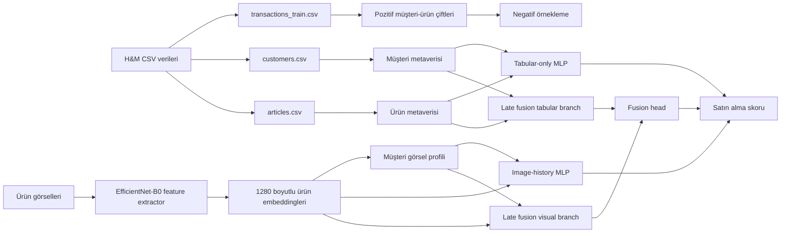
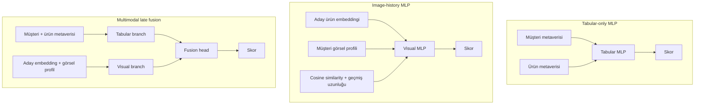
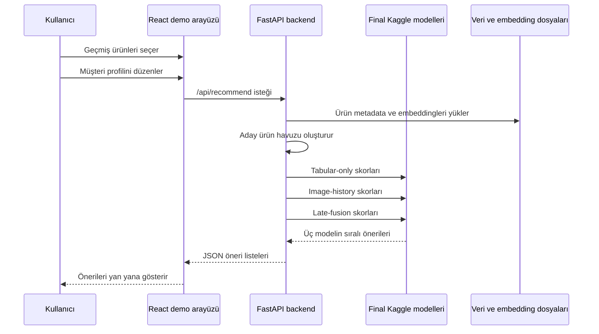

# Pipeline ve Model Diyagramları

Bu dosya, final rapora veya sunuma eklenebilecek Mermaid diyagramlarını içerir. Diyagramların amacı projenin üç ana modelini, veri akışını ve demo inference sürecini görsel olarak özetlemektir.

## 1. Genel Proje Pipeline'ı

## 2. Üç Modelin Girdi Farkı

## 3. Demo Inference Akışı

## 4. Rapor İçin Kısa Açıklama

Bu diyagramlar, çalışmanın bir Kaggle leaderboard optimizasyonundan çok multimodal recommendation hipotezini test eden deneysel bir sistem olduğunu vurgular. Tabular-only ve image-history modelleri tek modaliteli baseline olarak konumlanırken, late fusion modeli iki sinyali birleştiren ana modeldir. Demo arayüzü ise final checkpointlerin gerçek inference ortamında nasıl kullanılabileceğini göstermektedir.
