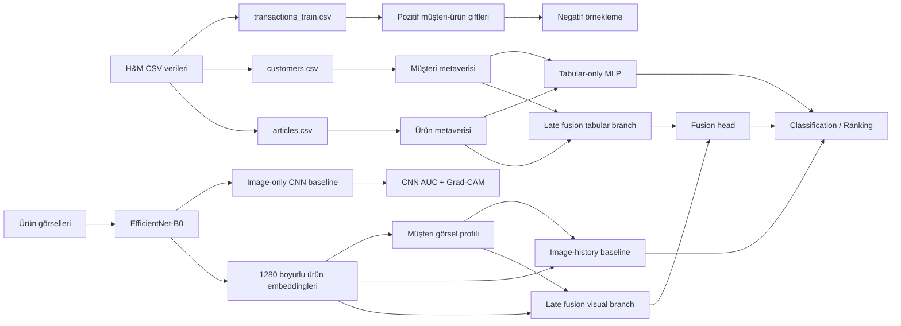
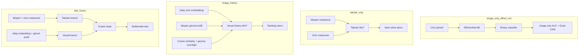
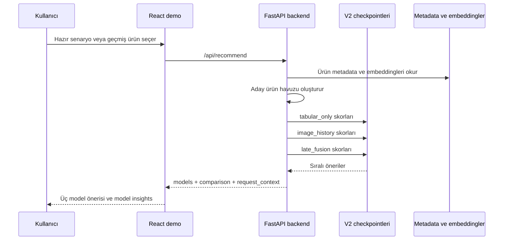

# Pipeline ve Model Diyagramları

Bu dosya final rapor ve sunuma eklenebilecek Mermaid diyagramlarını içerir.

## 1. Genel Proje Pipeline'ı

## 2. Model Ayrımı

## 3. Demo Inference Akışı

## 4. Sunum Mesajı

Classification tarafında CNN görsel baseline olarak vardır. Demo/ranking tarafında ise müşteri geçmişi gerektiği için `image_history` kullanılır. `late_fusion` iki sinyali birleştiren ana modeldir; `late_fusion_hybrid_*` yalnızca post-ranking deneyidir.
